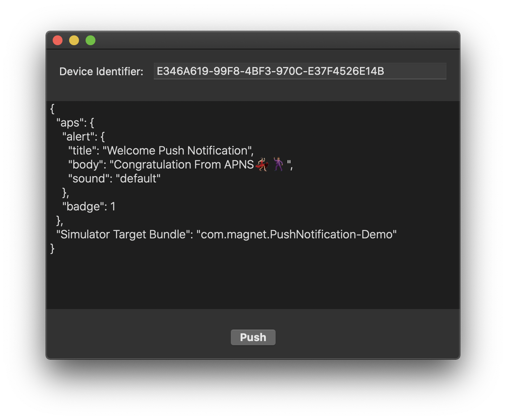

# SimPush
iOS Simulator Push Notification

  

## Requirements
- Xcode 11.4+
- Swift 5.2+

## Config
1. Get `Device Identifier` from `Xcode -> Devices and Simulators -> Simulators -> Right Click On Simulator Device -> Copy Identifier`
2. Paste in SimPush
3. Set your application bundle identifier into JSON payload
